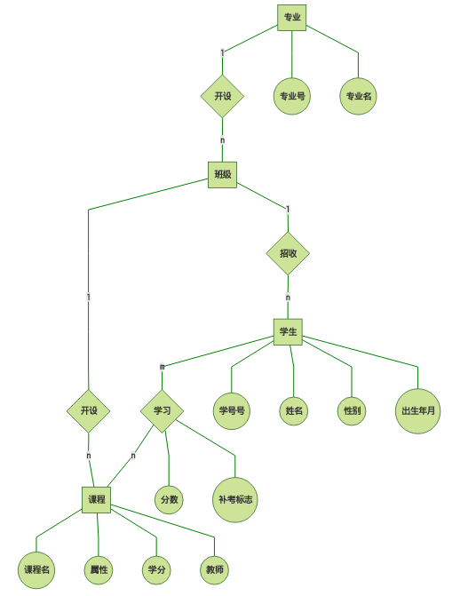
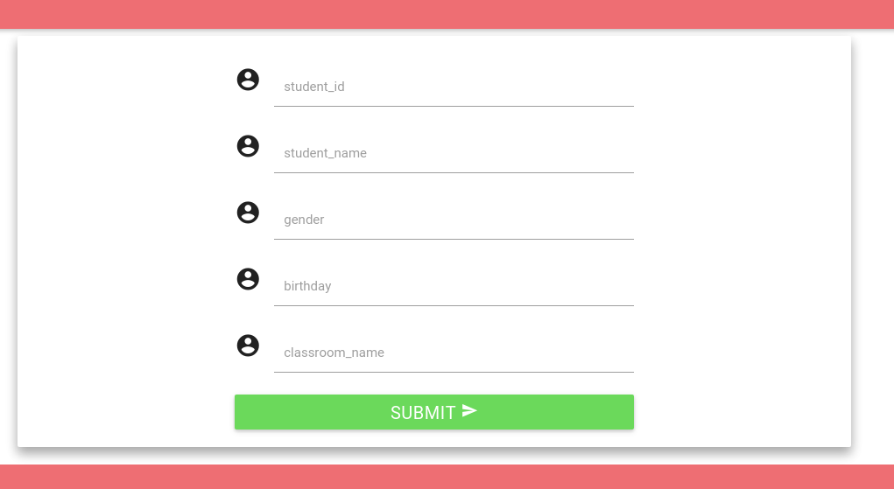
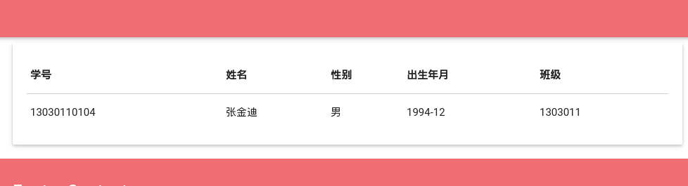
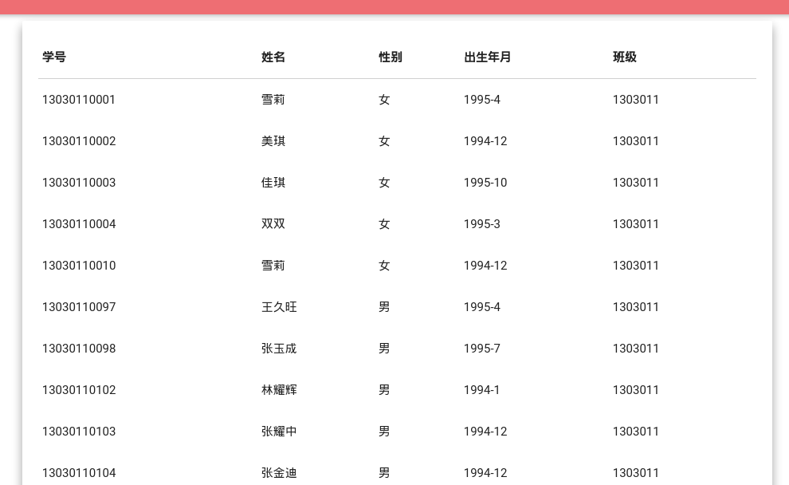
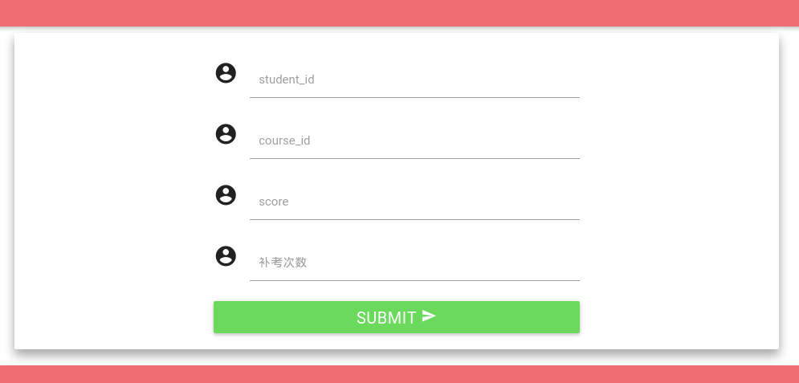
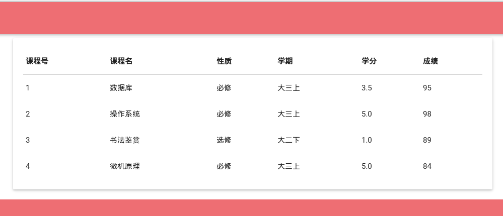
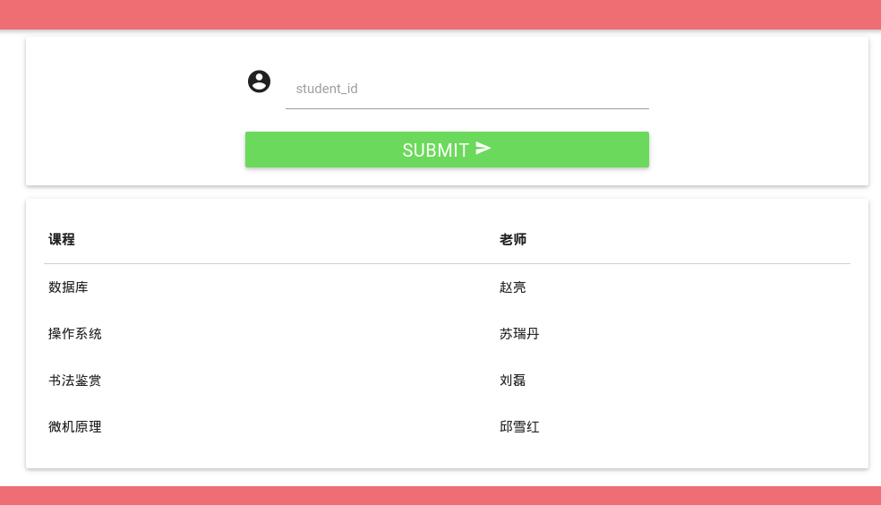

##需求分析（系统数据和功能）
###系统数据

1. 学校有若干专业,每个专业每年招若干个班,每个班有若干学生
2. 每个专业有自己的教学计划,规定了该专业相关课程的性质(必修或选修)以及授课学期;例如,数据库课程对计算机专业为必修、在大三上学期,但对数学专业可能为选修、在大三下学期,而中文专业可能不学这门课
3. 一位教师可以给多个班带课,但不能给一个班带多门课
4. 一门课程最多允许学生一次补考;学生达到如下条件之一的被开除:不及格必修课累计达15学分、或不及格选修课累计达20学分

###功能需求
1. 建库时应录入一定数量的(不能过少)学生、教师、课程、成绩等基本信息
2. 录入一位学生,应包含学号、姓名、性别、出生年月、班级等信息
3. 按学号、姓名、专业三种方式查询学生基本信息
4. 录入一学生成绩
5. 查询一位学生所修的课程、性质(必修或选修)、学期、学分及成绩;查询他的必修课平均成绩、所有课程平均成绩(平均成绩应按学分加权)
6. 查询一位学生被哪些教师教过课
7. 查询快要被开除的学生(距被开除差3学分之内)


##概念结构设计（E-R图设计）


##逻辑结构设计（E-R图转换为关系模型）

Major(专业号, 专业名)

码:专业号

Classroom(班级号, 专业号)

码:班机号, 外码:专业号

Student(学号, 姓名, 性别, 出生年月, 班级号)

码:学号, 外码:班级号

Course(课程号, 课程名, 课程属性, 学分, 教师, 班级号)

码:课程号(主码), (教师, 班级号), 并且课程号<—>(教师, 班级号), 外码:班级号

CourseScore(课程号, 学号, 补考标志, 分数)

码:(课程号,学号), 外码:课程号, 学号

##功能实现（选用哪种DBMS，如何用SQL实现功能，查询结果示例）
+ 选用mysql
+ sql实现:

```python
        # 录入一位学生，应包含学号、姓名、性别、出生年月、班级等信息
        student_id = request.POST.get('student_id')
        student_name = request.POST.get('student_name')
        gender = request.POST.get('gender')
        birthday = request.POST.get('birthday')
        classroom_name = request.POST.get('classroom_name')

        sql = '''
        INSERT INTO Student 
                    VALUES  ( \'%s\', \'%s\', \'%s\', \'%s\', \'%s\');
        ''' % (student_id, student_name, gender, birthday, classroom_name)
```



_ _ _


```python
        # 按学号方式查询学生基本信息
        student_id = request.POST.get('student_id')

        sql = '''SELECT * FROM Student 
        WHERE student_id = \'%s\' 
        ''' % student_id
```


_ _ _


```python    
        # 姓名方式查询学生基本信息
        student_name = request.POST.get('student_name')

        sql = '''SELECT * FROM Student 
               WHERE student_name = \'%s\' 
            ''' % student_name
```
```python		
        # 按专业方式查询学生基本信息
        major_name = request.POST.get('major')

        sql = '''SELECT student_id, student_name, gender, birthday, 
                    Student.classroom_name, major_name 
                FROM Student, Major, Classroom 
                WHERE Student.classroom_name = Classroom.classroom_name 
                    AND Classroom.major_id = Major.id
                    AND major_name = \'%s\' 
            ''' % major_name
```


_ _ _


```python
		# 录入一学生成绩， 根据make_up补考次数进行逻辑判断
        student_id = request.POST.get('student_id')
        course_id = request.POST.get('course_id')
        score = int(request.POST.get('score'))
        make_up = int(request.POST.get('make_up', '0'))
        if make_up == 1:
            if score > 60:
                score = 60
                sql = '''UPDATE CourseScore
                SET make_up = 1, score = %d
                WHERE student_id = \'%s\' AND course_id = \'%s\'
                ''' % (score, student_id, course_id)
            else:
                sql = ''
        else:
            sql = '''
            INSERT INTO CourseScore (student_id, course_id, score, make_up)
                        VALUES  ( \'%s\', \'%s\', %d, %d);
            ''' % (student_id, course_id, score, make_up)
```


_ _ _


```python
		# 查询一位学生所修的课程、性质（必修或选修）、学期、学分及成绩
        student_id = request.POST.get('student_id')

        sql = '''SELECT Course.course_id, course_name, property, teach_time,
        credit, score 
        FROM Course, CourseScore
        WHERE CourseScore.student_id = \'%s\' 
        AND Course.course_id = CourseScore.course_id
        ''' % (student_id)
```


_ _ _


```python
		# 查询他的必修课平均成绩、所有课程平均成绩（平均成绩应按学分加权）
        student_id = request.POST.get('student_id')

        sql = '''SELECT credit, score 
        FROM Course, CourseScore
        WHERE CourseScore.student_id = \'%s\' 
        AND Course.course_id = CourseScore.course_id
        ''' % (student_id)

        sql_b = '''SELECT credit, score 
        FROM Course, CourseScore
        WHERE CourseScore.student_id = \'%s\' 
        AND Course.course_id = CourseScore.course_id
        AND Course.property = \'%s\'
        ''' % (student_id, u'必修')
		
        # 然后对结果进行权值计算
```


_ _ _

```python
		# 查询一位学生被哪些教师教过课
        student_id = request.POST.get('student_id')

        sql = '''SELECT course_name, teacher 
        FROM Course, CourseScore
        WHERE CourseScore.student_id = \'%s\' 
        AND Course.course_id = CourseScore.course_id
        ''' % (student_id)

```


_ _ _


```python
	# 查询快要被开除的学生（距被开除差3学分之内）
    sql = '''SELECT student_id, SUM(credit) credit_sum
    FROM CourseScore, Course
    WHERE CourseScore.course_id = Course.course_id AND score < 60 
    AND Course.course_id IN(
            SELECT course_id
            FROM Course
            WHERE property = \'%s\'
        )
    GROUP BY student_id
    HAVING SUM(credit) IN(12, 13, 14) 
    ''' % (u'必修')

    sql_x = '''SELECT student_id, SUM(credit) credit_sum
    FROM CourseScore, Course
    WHERE CourseScore.course_id = Course.course_id AND score < 60 
    AND Course.course_id IN(
            SELECT course_id
            FROM Course
            WHERE property = \'%s\'
        )
    GROUP BY student_id
    HAVING SUM(credit) IN(17, 18, 19) 
    ''' % (u'选修')
```


##应用程序开发（选作限定，简要介绍）
###技术栈：
+ 运行环境linux(ubuntu14.04)
+ mysql数据库
+ 使用python为主要后台开发语言， django web framework框架
+ 前端web界面使用html, css, js开发， material design风格

###开发简述:
1. 使用python(django web framework)接收http请求，
	+ 通过请求得知要请求什么内容，例如用户输入学号，想得知该生的成绩信息。
	+ 或者接收到要提交的内容，例如录入一个学生的成绩信息。
	+ python接口连接数据库，运行sql语句，返回运行结果。
	+ 根据运行结果，向客户端返回信息，渲染web页面，展示结果。
2. css对web界面的美化， js提高前端动态交互性， 结果展示更美观

##遇到的主要问题及解决方法
1. mysql批量导入大量固定格式的数据时， 导入不成功， 提**示The used command is not allowed with this MySQL version。**
	**解决方案**: 通过查询，linux command下需要加入某个参数
2. mysql批量导入大量固定格式的有外键的数据不成功
	**解决方案**: 编写python脚本批量导入。

##总结
